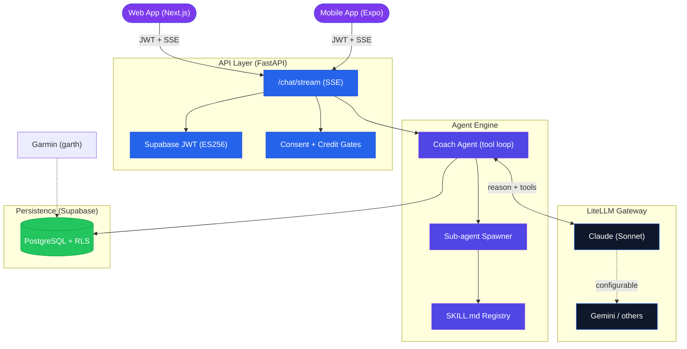
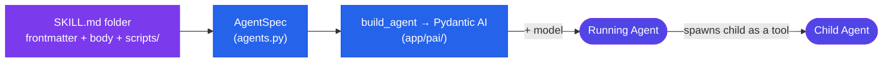
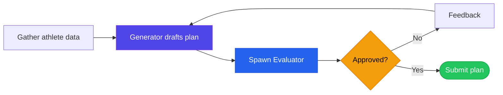
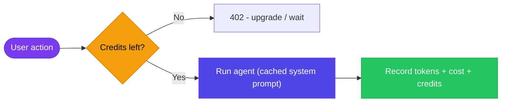

<div align="center">
  <h1>Athletly</h1>
  <h3>AI Training Coach - a declarative, self-evaluating multi-agent system</h3>
  <p>
    
    
    
    
    
    
    
    
  </p>
</div>

---

An AI coaching engine built around a **declarative agent architecture**: an agent is just a **Skill + a Model**. Capabilities are authored as `SKILL.md` folders (the agent registry), not hardcoded. Training plans are produced by a **generator agent that spawns an evaluator agent** and revises until quality passes, and the whole plan agent is guarded by an **eval harness with an LLM judge and severity calibration**. The code computes the objective facts, the LLM only interprets them. The plan/eval agents run on **Pydantic AI** (typed outputs); the chat coach streams on **LiteLLM**. One backend (FastAPI + Supabase) serves two clients from a shared design system: an **Expo** mobile app and a **Next.js** web app.

---

## Table of Contents

- [System Architecture](#system-architecture)
- [Declarative Skill-Based Agents](#declarative-skill-based-agents)
- [Plan Generation: the Spawn Mechanism](#plan-generation-the-spawn-mechanism)
- [Structured Outputs, Validation & Pydantic](#structured-outputs-validation--pydantic)
- [Eval Harness: Golden Fixtures + LLM Judge](#eval-harness-golden-fixtures--llm-judge)
- [Code Computes, the LLM Interprets](#code-computes-the-llm-interprets)
- [Cost Control: Prompt Caching + Credit Metering](#cost-control-prompt-caching--credit-metering)
- [Privacy by Design](#privacy-by-design)
- [Clients: Mobile + Web](#clients-mobile--web)
- [Tech Stack](#tech-stack)
- [Project Structure](#project-structure)
- [Getting Started](#getting-started)
- [Design Decisions](#design-decisions)
- [License](#license)

---

## System Architecture

One backend serves both clients. The chat endpoint streams every token and tool call in real time over Server-Sent Events; plan generation runs as nested sub-agents inside the same request.



---

## Declarative Skill-Based Agents

The central idea: **Agent = Skill + Model**. A skill is a directory (`skills/<name>/`) following the [Agent Skills](https://agentskills.io) convention: a `SKILL.md` with YAML frontmatter plus optional `scripts/` and `references/`. The frontmatter declares everything operational; the markdown body is the agent's system prompt. The agent registry is **built by scanning `skills/` and parsing frontmatter**, so a new agent is a new folder, zero Python.



### Anatomy of a skill

```yaml
# skills/plan/SKILL.md
---
name: plan
description: Build a fresh 2-week training plan from scratch.
allowed-tools: read_athlete_profile get_athlete_state search_activities web_search
metadata:
  athletly:
    activation: spawn                    # spawn (registry agent) | inline (prompt-injected)
    chat_triggerable: true               # the coach may launch it via run_specialist
    model: plan_model                    # alias resolved to a configured model
    spawns: [evaluate-plan]              # child agents it may spawn
    terminal_tool: submit_plan           # calling this ends the run; its args are the result
    terminal_schema: PLAN_SCHEMA         # JSON Schema the terminal args must match
    validator: scripts/validate_plan.py  # deterministic post-check on the result
    max_turns: 16
---
# (the markdown body below is the agent's system prompt / instructions)
```

| Frontmatter field | What it controls |
|---|---|
| `model` | which model the agent runs on (alias resolved to a configured model) |
| `allowed-tools` | the exact tools this agent may call (its capability boundary) |
| `spawns` | which child agents it may launch (each exposed to it as a tool) |
| `terminal_tool` + `terminal_schema` | the "submit" tool that ends the run; its args (matched to the JSON Schema) are the structured result |
| `validator` | a skill-bundled script that coerces + validates the terminal result |
| `activation` | `spawn` (discovered + spawnable) or `inline` (injected into the chat prompt on a trigger) |
| `max_turns` / `round_cap` | runaway guards that markdown cannot enforce |

### From a folder to a running agent

1. **Discovery** (`skills.py`): `scan_skills()` walks `skills/`, parses each `SKILL.md` frontmatter, and yields `ParsedSkill`s. The body (with `${SKILL_DIR}` substituted) becomes the system prompt.
2. **Registry** (`agents.py`): each `spawn`-activation skill becomes a frozen `AgentSpec`; `AGENT_SPECS` is built once at import. Inline skills (e.g. onboarding) are not registry agents, code injects them into the chat prompt on a deterministic trigger.
3. **Run** (`app/pai/`): `build_agent()` compiles the spec into a typed **Pydantic AI** `Agent`, the skill body as system prompt, the allowed-tools wrapped from `tools.py` (`Tool.from_schema`), and a Pydantic `output_type`. Pydantic AI drives the tool-calling loop; the run ends when the model calls the named output tool (validated against the model). Child agents are exposed as delegation tools, so spawning is just a tool call that runs another agent.

All operational config lives in the skill; all plumbing in `skills.py` + `agents.py` + `subagent.py`. A new agent is a new `SKILL.md`, no Python.

---

## Plan Generation: the Spawn Mechanism

A training plan is not produced in one shot. The **generator** (`skills/plan`) drafts a plan in a universal session grammar, **spawns an evaluator** (`skills/evaluate-plan`) that scores it against the rubric, then revises until it passes and submits. Both are just skills on the same engine; the nesting is the interesting part.



### How spawning works

A child skill is exposed to its parent **as a tool**. When the parent's model calls that tool, the handler runs the child agent and returns its result, so spawning is just a tool call that happens to run another agent:

1. In `spawn(name, ...)` (`agents.py`), the parent's tool set = its own `allowed-tools` + its `terminal_tool` + **one tool per child** listed in `spawns` (`_spawn_tool_schema`).
2. Calling a child tool invokes `_make_spawn_handler`, which calls `spawn(child, ...)` **recursively**. The generator/evaluator loop is therefore not hardcoded orchestration: it falls out of the `plan` skill listing `evaluate-plan` in its `spawns`.
3. **Depth + safety**: spawns nest up to `MAX_SPAWN_DEPTH` (3). Every event a sub-agent emits is tagged with its `depth` + `agent` name, so the client renders nested work indented (Claude-Code style).
4. **Round cap + early terminal**: the evaluation loop is capped. Once the cap is hit, the handler raises `EarlyTerminal(plan)` so the parent ends with its best draft directly, instead of paying for another full generation.
5. **Deterministic approval**: the evaluator returns severity-tagged `issues`; `_derive_binding_approval` computes `approved = (no blocking issues)` from the severities, **overriding the model's own boolean**. This kills the "perfectionist evaluator" trap where nothing ever passes.

Plans are written in a single **session grammar** so the same structure renders identically on web and mobile.

---

## Structured Outputs, Validation & Pydantic

The spawned plan + evaluator agents run on **Pydantic AI**: a skill compiles into a typed `Agent` whose `output_type` is a Pydantic model, so the structure is validated (and coerced) before anything ships. Pydantic also guards the HTTP edges. The streaming chat coach runs on **LiteLLM**.


- **API boundary, Pydantic v2.** Every request and response is a Pydantic model (`schemas.py`), validated by FastAPI. Untrusted input never reaches the agent unvalidated.
- **Agent output, typed via Pydantic AI.** A spawned agent's `output_type` is a Pydantic model (`TrainingPlan`, `EvaluationResult` in `app/pai/models.py`), exposed as a named output tool (`submit_plan`). The model's submission is validated against the model; the model's structured grammar (sessions, groups, steps) passes through as raw dicts so the typing never corrupts it.
- **Structure by construction.** Validators enforce the invariants the eval baseline exposed, exactly 2 weeks and 7 days per week, and **coerce** rather than reject (trim/pad), so a plan always submits with valid structure instead of looping on retries. This took the plan agent from 0/6 to 3/6 on the eval harness; the remaining failures are content quality, not structure.
- **Two engines, on purpose.** The multi-agent plan/eval path runs on Pydantic AI (typed outputs + agent delegation for spawning); the single-agent streaming chat coach runs on LiteLLM. Both are provider-agnostic (Claude by default).

---

## Eval Harness: Golden Fixtures + LLM Judge

The plan agent is regression-tested by an **eval harness**: golden athlete fixtures run through the real agent, and an **LLM judge** scores each output against a rubric, with **severity calibration** so the judge's strictness stays stable across runs.


Fixtures run concurrently with tight LLM timeouts and a single retry on transient failures. Reports are written to `services/api/app/evals/reports/`. This makes prompt and skill changes measurable rather than guesswork.

---

## Code Computes, the LLM Interprets

The objective fitness picture is computed in plain Python from the athlete's last 28 days of activities and 14 days of daily metrics. The LLM never does the math; it receives clean numbers and interprets them.

| Concern | Who handles it |
|---|---|
| Weekly volume, acute:chronic workload ratio (ACWR) | `athlete_state.py` (deterministic compute) |
| Typical paces / heart rate per sport, recovery baseline + trend | `athlete_state.py` |
| What this means for the athlete's readiness | The LLM, given the computed snapshot |
| How to phrase the next session or adjust load | The LLM, against the profile + beliefs |

`compute_state()` never crashes on sparse data and annotates data-quality caveats so the model can weigh them. The model's job is judgement, not arithmetic.

---

## Cost Control: Prompt Caching + Credit Metering

Two layers keep AI spend bounded. **Anthropic prompt caching** marks the large, stable system prompt as cacheable, cutting input cost on follow-up turns. A **credit meter** charges flat credits per user action (chat vs plan), enforced as a gate before any LLM call.



| Tier | Monthly credits | Source |
|---|---|---|
| Free | configurable (default 40) | the cost ceiling per user |
| Pro | configurable (default 1000) | RevenueCat subscription (webhook-driven) |
| Grandfather | unlimited | manual grant (founder / testers) |

A per-request meter (via `contextvars`) accumulates token usage across the chat turn and every spawned sub-agent into one charge. Real tokens and USD cost are logged to `ai_usage_events` for tuning. Subscriptions are handled with native in-app purchases through RevenueCat (the only viable path for App Store / Play Store digital subscriptions); the backend never sees a payment, only a tier flip via webhook.

---

## Privacy by Design

Health data is special-category data. Consent is explicit and gated server-side, and users can export or fully erase their data.

| Right | Implementation |
|---|---|
| Explicit consent (Art. 9) | Consent screen + an append-only `user_consents` audit trail; `/chat` returns 403 without a valid, current consent |
| Data export (Art. 20) | `GET /account/export` returns a portable JSON snapshot (no secrets/tokens) |
| Erasure (Art. 17) | `DELETE /account` wipes every account-scoped table and the auth user (all tables cascade) |
| Data minimization | Objective metrics are pseudonymous numbers; the LLM call avoids direct identifiers |

Garmin access uses the open-source `garth` library: because Garmin (unlike Strava) does not openly provide a developer API, this project uses `garth` to access the owner's own Garmin data. A production version would migrate to official Garmin OAuth.

---

## Clients: Mobile + Web

Both clients share one design system and the same backend. The web app exists because, without an App Store release, a browser app is the universal, zero-install client for desktop and mobile.

| | Mobile (`mobile/`) | Web (`web/`) |
|---|---|---|
| Framework | Expo / React Native, expo-router | Next.js App Router |
| Styling | NativeWind (Tailwind) | Tailwind |
| Design tokens + API types | `@athletly/shared` | `@athletly/shared` |
| Chat streaming | SSE via `react-native-sse` | SSE via `fetch` + `ReadableStream` |
| Payments | RevenueCat (native IAP) | n/a (mobile only) |
| Demo mode | - | seed data + scripted chat, no backend or key |
| PWA | - | manifest + service worker, add-to-home-screen |

The web app ships a **demo mode** (`NEXT_PUBLIC_DEMO_MODE=true`): seeded athlete data and a scripted coaching conversation, so the full UI can be deployed publicly with no backend, no API key, and no cost. With the flag off, it runs against the real backend.

---

## Tech Stack

| Layer | Technology | Role |
|---|---|---|
| **Backend** | FastAPI + Uvicorn | Async API + SSE streaming |
| **Agent runtime** | Pydantic AI | Typed plan/eval agents (output_type, validation, spawn delegation) |
| **LLM Gateway** | LiteLLM | Provider-agnostic model access (chat coach + Pydantic AI) |
| **Primary Model** | Claude (Sonnet) | Coach agent, plan generation, evaluation |
| **Database** | Supabase (PostgreSQL + RLS) | Persistence, row-level security, auth |
| **Auth** | Supabase JWT (ES256, JWKS) | Stateless token verification |
| **Wearables** | garth | Garmin Connect data access |
| **Billing** | RevenueCat | Native in-app subscriptions (webhook to backend) |
| **Mobile** | Expo / React Native + NativeWind | iOS/Android client |
| **Web** | Next.js + Tailwind | Universal browser client + PWA |
| **Shared** | `@athletly/shared` (npm workspace) | Design tokens + API contract types |
| **Eval** | Golden fixtures + LLM judge | Plan-agent regression testing |

---

## Project Structure

```
athletly/                        # npm-workspaces monorepo
├── services/api/                # FastAPI backend (Python)
│   ├── app/
│   │   ├── main.py              #   Routes: chat (SSE), garmin, profile, account, billing
│   │   ├── agent.py             #   Coach agent: LiteLLM streaming + tool loop + prompt caching
│   │   ├── agents.py            #   SKILL.md -> AgentSpec; spawn via Pydantic AI delegation
│   │   ├── pai/                 #   Pydantic AI layer: build_agent, typed models, tool adapter, Deps
│   │   ├── plan_agent.py        #   Plan entry: spawns the generator (which nests the evaluator)
│   │   ├── tools.py             #   Tool registry + schemas
│   │   ├── athlete_state.py     #   Objective fitness compute (ACWR, volume, paces, recovery)
│   │   ├── skills.py            #   Skill loading + frontmatter
│   │   ├── usage.py / billing.py#   Credit meter + tiers + RevenueCat webhook
│   │   ├── consent.py / account.py # GDPR consent, export, erasure
│   │   ├── auth.py / db.py / supabase_client.py
│   │   └── evals/               #   Golden fixtures + LLM judge + reports
│   ├── skills/                  #   plan/, evaluate-plan/, onboarding/ (SKILL.md folders)
│   └── supabase/migrations/     #   SQL migrations
│
├── web/                         # Next.js web client (+ demo mode + PWA)
│   └── src/{app,components,lib}  #   routes, ported components, hooks, demo seed/script
│
├── mobile/                      # Expo React Native client
│   └── {app,components,lib}      #   expo-router screens, components, hooks
│
└── packages/shared/             # @athletly/shared: design tokens + API types
```

---

## Getting Started

### Prerequisites
- Node.js 20+ and npm (for web + mobile workspaces)
- Python 3.12+ (for the backend)
- Supabase: either a hosted project, or run the **whole stack locally** with the Supabase CLI (Docker), no cloud account needed
- An Anthropic API key (or another LiteLLM-supported provider)

> **Want to just look at it?** The web app's **demo mode needs none of the above** (no Supabase, no API key). Skip to step 3.

> **Fully local Supabase:** Supabase is just hosted Postgres + Auth. `supabase start` (from `services/api`) spins up the entire stack in Docker, prints a local `SUPABASE_URL` + keys for your `.env`, and applies the migrations. So contributors can run the real backend **100% locally** without any Supabase cloud account.

### 1. Clone + install
```bash
git clone https://github.com/RnltLabs/Athletly.git
cd Athletly
npm install                      # installs the web + mobile workspaces
```

### 2. Backend (`services/api`)
```bash
cd services/api
uv sync                          # creates .venv + installs deps (or: pip install -e .)
cp .env.example .env             # fill in the values below
uv run uvicorn app.main:app --reload --port 8000
```
Required env (`services/api/.env`):
```
ANTHROPIC_API_KEY=...
SUPABASE_URL=...
SUPABASE_ANON_KEY=...
SUPABASE_SERVICE_ROLE_KEY=...
# optional: ATHLETLY_CHAT_MODEL, ATHLETLY_CREDITS_FREE, REVENUECAT_WEBHOOK_TOKEN, ...
```
Database, pick one:
```bash
# A) fully local: spins up Postgres + Auth in Docker and applies the migrations
supabase start                   # from services/api; prints local URL + keys for .env

# B) a hosted Supabase project: push the migrations to it
supabase db push                 # from services/api (migrations in supabase/migrations)
```

### 3. Web (`web`) - try it with zero backend
```bash
cd web
cp .env.example .env.local
# Demo mode: seeded data + scripted chat, no backend/key needed
echo "NEXT_PUBLIC_DEMO_MODE=true" >> .env.local
npm run dev                      # http://localhost:3000
```
For the real backend instead, set `NEXT_PUBLIC_DEMO_MODE=false` and provide
`NEXT_PUBLIC_API_URL`, `NEXT_PUBLIC_SUPABASE_URL`, `NEXT_PUBLIC_SUPABASE_ANON_KEY`.

### 4. Mobile (`mobile`)
```bash
cd mobile
cp .env.example .env             # EXPO_PUBLIC_API_URL, EXPO_PUBLIC_SUPABASE_URL, ANON_KEY
npx expo start
```

### 5. Run the eval harness (optional)
```bash
cd services/api && python -m app.evals.run
```

> Deploying the web demo: import the repo into Vercel, set **Root Directory = `web/`** (the npm workspace resolves automatically) and `NEXT_PUBLIC_DEMO_MODE=true`. No secrets required.

---

## Design Decisions

| Decision | Rationale |
|---|---|
| **Agent = Skill + Model** | New capabilities are authored as `SKILL.md`, not code. The engine is generic. |
| **Generator + Evaluator loop** | A plan is critiqued by a second agent and revised, with deterministic approval, not one-shot. |
| **Eval harness with LLM judge** | Prompt/skill changes are measured against golden fixtures, with severity calibration. |
| **Code computes, LLM interprets** | All training math is deterministic Python; the model only reasons over clean numbers. |
| **LiteLLM over a direct SDK** | Provider-agnostic; switch models with one config value. |
| **Prompt caching + credit meter** | Bounded, predictable AI cost; the free cap is the per-user cost ceiling. |
| **One backend, two clients, shared package** | Web + mobile stay in sync via `@athletly/shared`; the web app is the zero-install universal client. |
| **Privacy by design** | Explicit consent gate, full export + erasure, data minimization at the LLM boundary. |
| **RevenueCat for subscriptions** | The only compliant path for digital subscriptions on the App Store / Play Store. |

---

## License

MIT - see [LICENSE](LICENSE).

> Status: this is an open-source / portfolio release, not a maintained commercial product.
